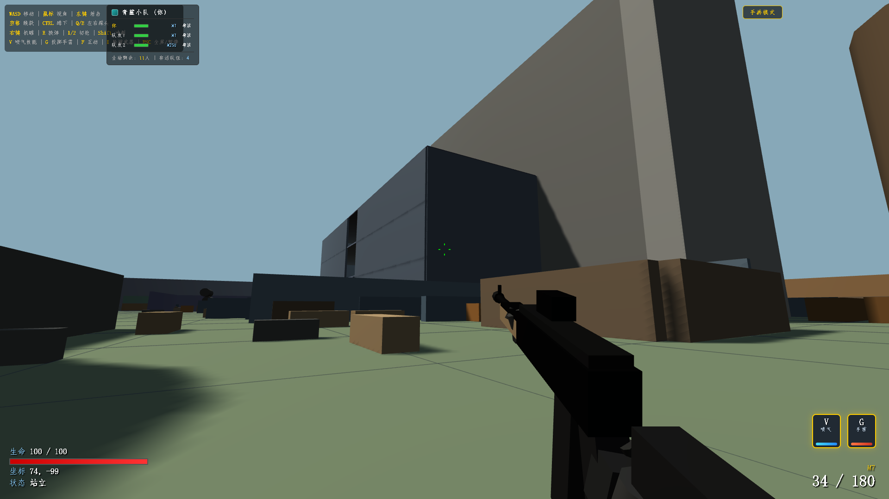

# 黑潮行动｜BlackTide‑Operation
> Three.js 跨端浏览器 FPS 射击原型，端手互通，电脑、手机浏览器直接打开即可游玩。
> Cross‑platform browser‑based FPS prototype built with Three.js. Runs directly on PC and mobile browsers.
> Plattformübergreifender FPS‑Prototyp für den Browser, entwickelt mit Three.js. Läuft direkt im Browser auf PC und Mobilgerät.

---

## ✨ 项目特性 | Features | Funktionen

**中文**
- 🖥️ PC端：键盘鼠标完整FPS操控，Q/E侧身探头、机瞄、冲刺、喷气跳跃、手雷投掷
- 📱 移动端：全套虚拟触控按键，手机浏览器直接运行
- 🎯 游戏机制：多阵营AI对战、倒地救援复活系统、蝴蝶刀近战武器
- 🏗️ 交互场景：可击碎玻璃、可交互电梯、弹药补给箱、大量战术掩体
- 📦 零外部资源：全部模型、音效通过代码程序化生成，不依赖外部模型、音频文件
- 📄 单文件项目：仅 index.html，双击即可本地运行

**English**
- 🖥️ PC: Full keyboard‑mouse FPS controls, Q/E lean, ADS aim, sprint, jet‑boost jump, grenade throw
- 📱 Mobile: Complete on‑screen touch controls, runs directly in mobile browser
- 🎯 Game mechanics: Multi‑team AI combat, down‑but‑not‑dead revive system, butterfly‑knife melee weapon
- 🏗️ Interactive world: Breakable glass, functional elevator, ammo supply crate, plenty of tactical covers
- 📦 Zero external assets: All models and sound effects are procedurally generated by code, no external model/audio files
- 📄 Single‑file project: Only index.html, double‑click to run locally

**Deutsch**
- 🖥️ PC: Vollständige Tastatur‑Maus‑FPS‑Steuerung, Lehnen mit Q/E, Zielfernrohr‑Modus, Sprint, Jet‑Boost‑Sprung, Granatenwurf
- 📱 Mobil: Komplette virtuelle Touch‑Tasten, läuft direkt im mobilen Browser
- 🎯 Spielmechaniken: KI‑Gefechte mehrerer Fraktionen, Niederschlag‑Wiederbelebung‑System, Nahkampfwaffe Schmetterlingsmesser
- 🏗️ Interaktive Umgebung: Zerspringbares Glas, funktionsfähiger Aufzug, Munitionsboxen, zahlreiche taktische Deckungen
- 📦 Keine externen Ressourcen: Alle Modelle und Geräusche werden per Code generiert, keine externen 3D‑Modelle oder Audiodateien
- 📄 Ein‑Datei‑Projekt: Nur index.html, Doppelklick zum lokalen Starten

---

## 🎮 操作说明 | Controls | Steuerung

**中文【PC端】**
WASD移动｜鼠标视角｜左键射击｜右键机瞄
空格跳跃｜CTRL蹲下｜Q/E左右探头｜Shift冲刺
V 喷气技能｜G 手雷｜R 换弹｜1/2切枪｜F互动｜ESC暂停

**English【PC】**
WASD move｜mouse look｜left‑click fire｜right‑click ADS aim
Space jump｜CTRL crouch｜Q/E lean left/right｜Shift sprint
V jet‑boost｜G grenade｜R reload｜1/2 switch weapon｜F interact｜ESC pause

**Deutsch【PC】**
WASD Bewegung｜Maus Blick｜Linksklick Schießen｜Rechtsklick Zielen
Leertaste Sprung｜CTRL Hocken｜Q/E links/rechts lehnen｜Shift Sprint
V Jet‑Boost｜G Granate｜R Nachladen｜1/2 Waffe wechseln｜F Interagieren｜ESC Pause

**中文【移动端】**
屏幕右侧全套虚拟触控按钮，支持射击、瞄准、跳跃、冲刺、互动、切枪。

**English【Mobile】**
Full set of virtual touch buttons on screen: fire, aim, jump, sprint, interact, weapon switch.

**Deutsch【Mobil】**
Vollständige virtuelle Touch‑Tasten auf dem Bildschirm: Schießen, Zielen, Sprung, Sprint, Interagieren, Waffenwechsel.

---

## 🚀 如何运行 | How to run | Ausführen

**中文**
1. 下载仓库内 `index.html`
2. 使用现代浏览器直接打开该文件即可，无需搭建服务器。
3. 也可通过 GitHub Pages 在线体验。

**English**
1. Download `index.html` from repository
2. Open the file directly with a modern web browser, no server required.
3. Online demo available via GitHub Pages.

**Deutsch**
1. Lade `index.html` aus dem Repository herunter
2. Öffne die Datei direkt in einem modernen Browser, kein Server notwendig.
3. Online‑Demo über GitHub Pages erreichbar.

---

## ⚠️ 项目说明 | Note | Hinweis

**中文**
本项目为**技术演示原型，仅供学习研究，禁止商用**。
项目大量借助 Trae AI 迭代开发，全部玩法机制、关卡设计由人类设计者主导定义。
依赖：Three.js（MIT License）

**English**
This project is a **technical demo for study purposes only, commercial use is forbidden**.
Iteratively built with Trae‑AI assistance; all gameplay mechanics and level design are defined by human designer.
Dependency: Three.js (MIT License)

**Deutsch**
Dieses Projekt ist ein **technischer Demonstrator nur zu Lernzwecken, kommerzielle Nutzung verboten**.
Iterativ entwickelt mit Unterstützung von Trae‑KI; alle Spielmechaniken und Level‑Gestaltung stammen vom menschlichen Entwickler.
Abhängigkeit: Three.js (MIT‑Lizenz)

---

## 📌 已知局限 | Known limitations | Bekannte Einschränkungen

**中文**
- 单机原型，暂无网络联机功能
- 大量AI与几何体，低配设备会出现性能压力

**English**
- Single‑player prototype, no online multiplayer yet
- Large amount of AI agents and geometry may cause performance drop on low‑end devices

**Deutsch**
- Einzelspieler‑Prototyp, noch kein Online‑Mehrspieler
- Viele KI‑Einheiten und Geometrien können auf leistungsschwachen Geräten Leistungseinbußen verursachen

---

## 📜 License
MIT
